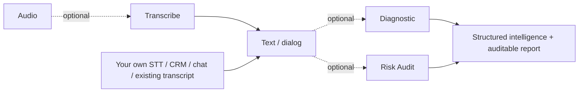

# falaai-api — Node.js / TypeScript SDK for Conversation Intelligence, Speech Analytics & Compliance

[](https://www.npmjs.com/package/falaai-api)
[](LICENSE)
[](https://github.com/ActionTecBr/falaai-api-node/actions/workflows/ci.yml)
[](https://actiontecbr.github.io/falaai-api-node/)

Official **Node.js / TypeScript SDK** for the **FalaAI API** — transcribe audio, analyze conversations and audit compliance (COPC CX, ISO 18295-1). **Use each API independently or combine them into your own pipeline.**

> Analyze calls, contact-center recordings, voice notes, chat and email. Get speaker-separated transcripts, summaries, reasons, actions, sentiment and a **compliance risk score**.

## Use any FalaAI API independently

FalaAI is a set of **independent REST APIs**. You **do not** need FalaAI Transcription to use FalaAI analysis or compliance auditing. If your application already has a transcript (your own speech-to-text, a chatbot transcript, CRM history or messaging), send that text straight to the analysis APIs.

| If you have... | Use |
|---|---|
| Audio but no transcript | `SpeechApi` — Transcription |
| An existing transcript | `AnalysisApi` — Diagnostic |
| A transcript needing compliance analysis | `AnalysisApi` — Risk Audit |
| An existing transcript needing both | Diagnostic + Risk Audit |
| Your own STT provider (Whisper, Deepgram...) | Skip FalaAI Transcription |

```text
Your STT                             ->  FalaAI Diagnostic  ->  FalaAI Risk Audit
Telegram voice -> your STT           ->  FalaAI Risk Audit
3CX / Asterisk / Genesys transcript  ->  FalaAI Diagnostic  ->  FalaAI Risk Audit
CRM conversation                     ->  FalaAI Risk Audit
```

> Integrate FalaAI at **any point** of your pipeline — not only at capture/transcription.

## Use the APIs the way you want

Every FalaAI API is **independent and optional** — chain any subset, in any combination.



> Skip **Transcribe** if you already have text. Call only **Diagnostic**, only **Risk Audit**, or both — whatever your case needs.

## Install

```bash
npm install falaai-api
```

ES Modules (the package is ESM). CI runs on Node.js 22.

## Quickstart

### 1. Get an API key
Create a free account and copy your `fai_` key: <https://falaai.action.tec.br/api/auth> (or the [Dashboard](https://falaai.action.tec.br/api/dashboard)).

### 2. Set environment variables

```bash
FALAAI_BASE_URL=https://api01-falaai.action.tec.br
FALAAI_API_KEY=fai_xxxxxxxx
```

### 3. Transcribe a call (audio -> text)

```typescript
import { readFileSync } from "node:fs";
import { Configuration, SpeechApi } from "falaai-api";

const config = new Configuration({
  basePath: process.env.FALAAI_BASE_URL ?? "https://api01-falaai.action.tec.br",
  accessToken: process.env.FALAAI_API_KEY ?? "",
});
const speechApi = new SpeechApi(config);

const file = new Blob([readFileSync("call.mp3")], { type: "audio/mpeg" });

const transcription = await speechApi.createTranscriptionV1AudioTranscriptionsPost({
  file,
  model: "falaai-transcribe-1",
  language: "pt",
  clientReferenceId: "call_202609271408",
});

console.log(JSON.stringify(transcription, null, 2));
```

Expected response (abridged):

```json
{
  "id": "tr-...",
  "object": "transcription",
  "model": "falaai-transcribe-1",
  "language": "por",
  "duration_seconds": 25.0,
  "text": "...",
  "dialog": "Speaker 1: [...] ...",
  "usage": { "audio_seconds": 25.0, "credits_consumed": 25, "processing_ms": 951 }
}
```

> Only need analysis? **Skip step 3** and call `AnalysisApi` with your own transcript (use `text` for a plain transcript).

### 4. Analyze or audit an existing transcript (no transcription needed)

```typescript
import { Configuration, AnalysisApi } from "falaai-api";

const analysis = new AnalysisApi(new Configuration({
  basePath: process.env.FALAAI_BASE_URL ?? "https://api01-falaai.action.tec.br",
  accessToken: process.env.FALAAI_API_KEY ?? "",
}));

const transcript = "Good morning, how can I help? I need to cancel my subscription.";

// 5 analyses in one call: summary, reason, action, topic, sentiment
const diagnostic = await analysis.createDiagnosticV1AnalyzeDiagnosticPost({
  diagnosticRequest: { text: transcript, language: "pt-BR", durationSeconds: 81.46 },
});

// Compliance risk score + violations + auditable report
const audit = await analysis.createRiskAuditV1AnalyzeRiskAuditPost({
  riskAuditRequest: { text: transcript, language: "pt-BR", responseLanguage: "pt-BR", durationSeconds: 81.46 },
});
```

## What is FalaAI API?

FalaAI API is an **AI conversation-intelligence API** for analyzing customer-service, contact-center, sales, messaging and other business conversations. It combines speech-to-text (with speaker diarization and audio-event detection), conversation analysis (summary, contact reason, action taken, topic classification, sentiment) and a **compliance/risk audit** against **COPC CX** and **ISO 18295-1**. Conversation content is processed and discarded (zero-storage).

## What can you do with FalaAI?

- **Transcribe** audio to text with speaker separation and audio events.
- **Diagnose** a conversation: summary, reason, action taken, topic and sentiment.
- **Audit** conversations: compliance risk score, detections/violations and an auditable HTML report.
- **Track usage**, **manage webhooks** and **email alerts**, and **health/version** checks.

## Use cases

- **Contact center / Quality** — audit 100% of conversations instead of a sample.
- **Compliance / Legal** — auditable evidence for audits and disputes.
- **CX / Operations** — risk score, sentiment and reason per conversation.
- **BI / Data** — typed JSON ready for your database or analytics stack.

## SDK surface (Node.js / TypeScript)

| Class | Import | Purpose |
|---|---|---|
| `Configuration` | `falaai-api` | `basePath`, `accessToken` |
| `HealthApi` | `falaai-api` | `healthCheck()`, `healthCheckHeadRaw()` |
| `SpeechApi` | `falaai-api` | `createTranscriptionV1AudioTranscriptionsPost(...)` |
| `AnalysisApi` | `falaai-api` | `createDiagnosticV1AnalyzeDiagnosticPost(...)`, `createRiskAuditV1AnalyzeRiskAuditPost(...)` |
| `UsageApi` / `WebhooksApi` / `EmailAlertsApi` / `VersionApi` | `falaai-api` | management |
| Models | `falaai-api` | `DiagnosticRequest`, `DiagnosticResponse`, `RiskAuditRequest`, `RiskAuditV2Response`, `Participant`, `DiagnosticAudioEvent` |

> Model IDs: `falaai-transcribe-1`, `falaai-diagnostic-1`, `falaai-risk-audit-1`.

## Examples

Runnable examples in [`examples/`](./examples): `health.ts`, `transcribe.ts`, `diagnose.ts`, `audit.ts`.

## Authentication

Every request requires `Authorization: Bearer fai_<your_key>` — except the public endpoints (`GET/HEAD /v1/health`, `GET /api/version`). Set the key with `Configuration.accessToken` (or `FALAAI_API_KEY`).

## Error handling

The SDK throws `ResponseError` (and `FetchError` / `RequiredError`) on failures. Wrap calls in `try/catch`.

```typescript
import { Configuration, HealthApi, ResponseError } from "falaai-api";

const healthApi = new HealthApi(new Configuration({ basePath: process.env.FALAAI_BASE_URL }));

try {
  console.log((await healthApi.healthCheck()).status);
} catch (error) {
  if (error instanceof ResponseError) {
    console.error(`HTTP ${error.response.status}`);
  } else {
    throw error;
  }
}
```

## Where to integrate (this SDK)

FalaAI is language-independent; this package targets **Node.js / TypeScript** backends.

| Platform / environment (this SDK's language: **Node.js / TypeScript**) | Integration |
|---|---|
| **HubSpot** | `falaai-api` (Node) |
| **Zendesk** | `falaai-api` (Node) |
| **Pipedrive** | `falaai-api` (Node) |
| **WhatsApp Business** | `falaai-api` (Node) |
| **Telegram** bots | `falaai-api` (Node) |
| **Express / NestJS / Next.js API routes** | `falaai-api` |
| Other stacks (3CX, Salesforce, Genesys...) | REST / cURL — [API reference](https://api01-falaai.action.tec.br/docs) (or the SDK for that backend's language) |

> These are **integration examples**, not certified native integrations. Any platform can integrate through **REST / cURL** — see the [API reference](https://api01-falaai.action.tec.br/docs). Authenticated calls use `Authorization: Bearer fai_<key>`.

## Production usage

- Store API keys in environment variables or a secret manager — never hard-code.
- Reuse a single `Configuration` / API client across requests.
- Handle `ResponseError` explicitly.
- Set sensible timeouts for long-running requests.

## Compatibility

| Requirement | Version |
|---|---|
| Node.js | ES Modules (CI on Node 22) |
| API | v1.21.49 |

## Documentation

- **SDK docs (this language):** <https://actiontecbr.github.io/falaai-api-node/>
- **API reference (Swagger UI):** <https://api01-falaai.action.tec.br/docs>
- **OpenAPI contract:** <https://api01-falaai.action.tec.br/openapi.json>
- **Sandbox:** <https://falaai.action.tec.br/api#playground>
- **Quickstart:** <https://falaai.action.tec.br/api/quickstart>
- **Product page:** <https://falaai.action.tec.br/api>

## Versioning

Semantic versioning; the SDK version tracks the API version (`1.21.49`). See [CHANGELOG.md](CHANGELOG.md) and [Releases](https://github.com/ActionTecBr/falaai-api-node/releases).

## Security

See [SECURITY.md](SECURITY.md). Never commit real keys — use environment variables.

## Contributing

See [CONTRIBUTING.md](CONTRIBUTING.md).

## License

[MIT](LICENSE).

## Links

- Website: <https://falaai.action.tec.br>
- API base URL: <https://api01-falaai.action.tec.br>
- GitHub organization: <https://github.com/ActionTecBr>
- Other SDKs: Python, PHP, Go, Ruby, Java, .NET.

### Platform documentation (orientation)

- HubSpot — <https://developers.hubspot.com/docs>
- Zendesk — <https://developer.zendesk.com/documentation/>
- Pipedrive — <https://developers.pipedrive.com>
- WhatsApp Business — <https://developers.facebook.com/docs/whatsapp/cloud-api/>
- Telegram — <https://core.telegram.org/bots/api>