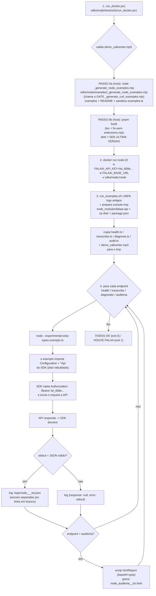

# FLUXO DE TESTES DA SDK NODE (`falaai-api`)
@version 1.3.0 | 30/09/2026 | MANUAL — nao e regenerado pelo exportador de exemplos
SDK: `D:\ProjetoFalaAI\FalaAI\FalaAI_api\sdks\node\` (pacote npm `falaai-api`) · Docker da linguagem: imagem oficial `node:22`
Regra de fundo: `.opencode/rules/macro/modulos/falaai-api/sdk-fonte-unica.md` (tests/e2e = MANUAL)

> **v1.3.0 (30/09):** atualizado apos a MIGRACAO do SDK Node para **openapi-generator 7.25.0** (`-g typescript-fetch`): o SDK agora e `Configuration` + `*Api` (camelCase); `openapi-fetch`/`createFalaAIClient` NAO existem mais; o wrapper REBUILDA o SDK (PASSO 0b) e o runner LIMPA os logs antigos.

## Scripts e arquivos usados (nomes e paths exatos)
| # | Script / Arquivo | Path completo | Papel no fluxo |
|---|---|---|---|
| 1 | `run_docker.ps1` v1.2.0 | `D:\ProjetoFalaAI\FalaAI\FalaAI_api\sdks\node\tests\e2e\run_docker.ps1` | WRAPPER (PowerShell): valida mp3 → **PASSO 0a** (sync exemplos) → **PASSO 0b** (`pnpm build` = SDK ultima versao) → sobe o Docker `node:22` |
| 2 | `run_examples.sh` v1.2.0 | `D:\ProjetoFalaAI\FalaAI\FalaAI_api\sdks\node\tests\e2e\run_examples.sh` | RUNNER (bash, roda DENTRO do container): **limpa logs antigos**, prepara o console tmp, executa os 4 exemplos, grava os logs JSON + `.html` |
| 3 | `_generate_node_examples.mjs` v1.4.0 | `D:\ProjetoFalaAI\FalaAI\FalaAI_api\sdks\node\examples\_generate_node_examples.mjs` | EXPORTADOR (**PASSO 0a**, roda no host): re-exporta os 4 exemplos da FONTE UNICA + **gera o README** (versao/data) |
| 4 | `_generate_curl_examples.mjs` | `D:\ProjetoFalaAI\FalaAI\FalaAI_api\sdks\curl\examples\_generate_curl_examples.mjs` | GATE interno (chamado pelo exportador node): valida cURL vs fonte unica — exit 1 se divergir |
| 5 | `sandbox-examples.ts` | `D:\ProjetoFalaAI\FalaAI\FalaAI_landing\lib\sandbox-examples.ts` | FONTE UNICA dos exemplos (8 linguagens x 4 endpoints, tokens `{{...}}`) |
| 6 | `health.ts` · `transcribe.ts` · `diagnose.ts` · `audit.ts` | `D:\ProjetoFalaAI\FalaAI\FalaAI_api\sdks\node\examples\*.ts` | OS 4 EXEMPLOS GERADOS (exatamente o que o runner executa — nunca reescrito a mao) |
| 7 | `README.md` | `D:\ProjetoFalaAI\FalaAI\FalaAI_api\sdks\node\examples\README.md` | manual dos exemplos (**GERADO** pelo exportador v1.4.0 — versao/data) |
| 8 | `dist/` + `package.json` | `D:\ProjetoFalaAI\FalaAI\FalaAI_api\sdks\node\dist\` | O SDK compilado (**rebuildado no PASSO 0b**) — copiado para o tmp como `node_modules/falaai-api` |
| 9 | `fix-esm-extensions.mjs` | `D:\ProjetoFalaAI\FalaAI\FalaAI_api\sdks\node\fix-esm-extensions.mjs` | POS-BUILD: adiciona `.js` nos imports relativos do `dist/` (ESM do Node exige extensao) |
| 10 | `src/` (gerado) | `D:\ProjetoFalaAI\FalaAI\FalaAI_api\sdks\node\src\` | client GERADO (openapi-generator): `apis/` + `models/` + `runtime.ts` + `index.ts` |
| 11 | `demo_callcenter.mp3` | `D:\ProjetoFalaAI\FalaAI\FalaAI_api\sdks\node\tests\e2e\demo_callcenter.mp3` | audio do teste (1.3 MB) |
| 12 | `logs\node_<endpoint>_<ts>_tst.json` (+ `.html`) | `D:\ProjetoFalaAI\FalaAI\FalaAI_api\sdks\node\tests\e2e\logs\` | LOGS gerados pelo runner (**limpa os antigos a cada rodada**) |
| 13 | `VERSION.txt` | `D:\ProjetoFalaAI\FalaAI\FalaAI_api\VERSION.txt` | versao da API que o health devolve (`api_v1.21.49`) — SEM BOM |
| 14 | `_FLUXO_TESTE_SDK_NODE.md` (este doc) | `D:\ProjetoFalaAI\FalaAI\FalaAI_api\sdks\node\examples\_FLUXO_TESTE_SDK_NODE.md` | este doc |

## Requisitos do dev (inviolaveis)
- R-A: roda em Docker DA LINGUAGEM (`node:22`)
- R-B: roda os 4 exemplos GERADOS (`health/transcribe/diagnose/audit.ts`) — nunca reescreve
- R-C: LOG = request (codigo do exemplo) + response (o que o SDK devolveu) + `.html` da auditoria
- R-D: chave `fai_668e6474b83dd24540860d9ab9df0b738f7171a0f5bd8179` hardcoded no runner (local-only)
- R-E: **PASSO 0 antes de tudo** — exemplos sincronizados com a FONTE UNICA + **SDK rebuildado** (ultima versao)

## Fluxo (com os nomes reais dos scripts)


## Comando (API no micro do dev)
```powershell
powershell -ExecutionPolicy Bypass -File "D:\ProjetoFalaAI\FalaAI\FalaAI_api\sdks\node\tests\e2e\run_docker.ps1" -BaseUrl http://host.docker.internal:8002 -Only all
# -Only: all | health | transcribe | diagnostic | auditoria
# health = publico (sem creditos) · transcribe/diagnostic/auditoria = consomem creditos da chave FAI
```

## Log (formato — secoes separadas por linha em branco, JSON valido)
```json
{
  "language": "node",
  "endpoint": "health",
  "generated_at": "2026-09-30T11:36:10Z",

  "request": "<codigo do exemplo .ts, linhas escapadas como \n>",

  "response": { "o que o SDK node devolveu, indentado (camelCase)" }
}
```
Falha: `"response": null, "error": "<stdout/stderr>"` · Auditoria: + `node_auditoria_<ts>_tst.html` (unzip de `htmlReport`)

## O que garantir
1. O exemplo importa o SDK (`Configuration` + `*Api`, `dist/` rebuildado) — NUNCA chamada HTTP/curl direta.
2. O request sai do SDK (Bearer fai_...) — a API responde — o SDK devolve — o runner grava o log.
3. PASSO 0 roda ANTES de qualquer teste (exemplos na ultima versao da fonte unica + SDK rebuildado).
4. O runner LIMPA os logs antigos a cada rodada (so os da execucao atual ficam).
5. Refaco a qualquer momento: mesmo comando = mesmo comportamento (deterministico).

## Historico
- **v1.3.0 (30/09 11:47):** atualizado apos a MIGRACAO p/ openapi-generator 7.25.0: SDK = `Configuration`+`*Api` (camelCase); removidos `openapi-fetch`/`createFalaAIClient`; PASSO 0b (`pnpm build` + `fix-esm-extensions.mjs`); runner limpa logs antigos; `htmlReport` (camelCase) no unzip; README dos exemplos volta a ser GERADO (v1.4.0).
- **v1.2.0 (29/09 23:0x):** doc reescrito ESPECIFICO da SDK node (pedido do dev — "listar os nomes dos scripts, nada generico"): tabela dos 14 scripts/arquivos com paths exatos + Mermaid com os nomes reais.
- **v1.1.0 (29/09 23:0x):** R-E (PASSO 0) · log com secoes separadas · hotfix VERSION.txt sem BOM.
- **v1.0.0 (29/09 21:5x):** doc inicial.